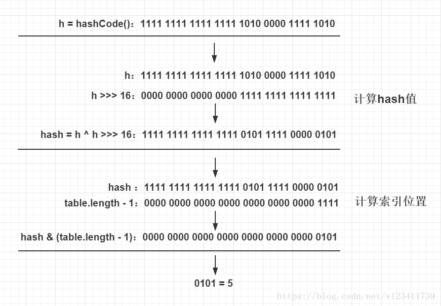

JDK1.8 HashMap

### 定位哈希桶数组索引位置
不管增加、删除、查找键值对，定位到哈希桶数组的位置都是很关键的第一步。前面说过HashMap的数据结构是“数组+链表+红黑树”的结合，所以我们当然希望这个HashMap里面的元素位置尽量分布均匀些，尽量使得每个位置上的元素数量只有一个，那么当我们用hash算法求得这个位置的时候，马上就可以知道对应位置的元素就是我们要的，不用遍历链表/红黑树，大大优化了查询的效率。HashMap定位数组索引位置，直接决定了hash方法的离散性能。下面是定位哈希桶数组的源码：
```
// 代码1
// 计算key的hash值
static final int hash(Object key) {
    int h;
    // 1.先拿到key的hashCode值; 2.将hashCode的高16位参与异或运算
    return (key == null) ? 0 : (h = key.hashCode()) ^ (h >>> 16);
}
// 代码2
int n = tab.length;
// 将(tab.length - 1) 与 hash值进行&运算
int index = (n - 1) & hash;
```
整个过程本质上就是三步：
1.拿到key的hashCode值
2.将hashCode的高16位和低16位重新参与运算，重新计算hash值
3.将计算出来的hash值与(table.length-1)进行&运算
#### 方法解读：
对于任意给定的对象，只要它的hashCode()返回值相同，那么计算得到的hash值总是相同的。我们首先想到的就是把hash值对table长度取模运算，这样一来，元素的分布相对来说是比较均匀的。

但是模运算消耗还是比较大的，我们知道计算机比较快的运算为位运算，因此JDK团队对取模运算进行了优化，使用上面代码2的位与运算来代替模运算。这个方法非常巧妙，它通过 “(table.length -1) & h” 来得到该对象的索引位置，这个优化是基于以下公式：x mod 2^n = x & (2^n - 1)。我们知道HashMap底层数组的长度总是2的n次方，并且取模运算为“h mod table.length”，对应上面的公式，可以得到该运算等同于“h & (table.length - 1)”。这是HashMap在速度上的优化，因为&比%具有更高的效率。

在JDK1.8的实现中，还优化了高位运算的算法，将hashCode的高16位与hashCode进行异或运算，主要是为了在table的length较小的时候，让高位也参与运算，（可以在一定程度上，降低冲突......），并且不会有太大的开销。

下图是一个简单的例子，table长度为16：
